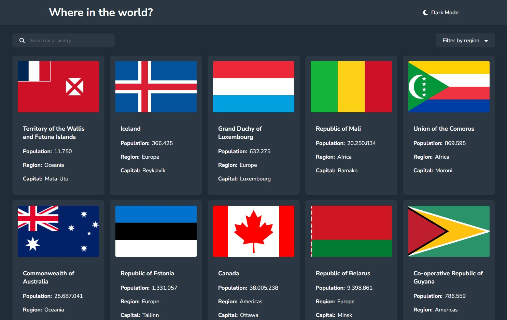
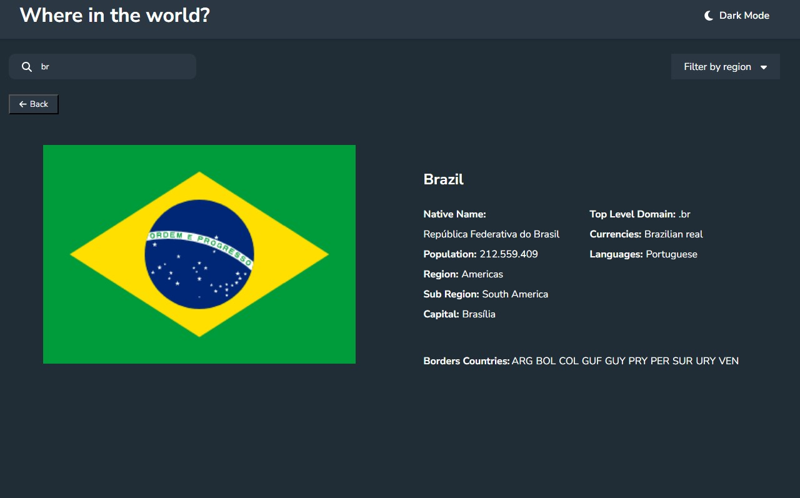

# Country Explorer

Country Explorer is a web application that integrates with the [REST Countries API](https://restcountries.com) to pull country data and display it in a user-friendly format. This project was built using React and provides features such as searching, filtering, and viewing detailed information about countries. Additionally, the application supports a dark mode toggle.





## Features

- Display all countries from the API on the homepage
- Search for a country using an `input` field
- Filter countries by region
- Click on a country to see more detailed information on a separate page
- Click through to the border countries on the detail page
- Toggle the color scheme between light and dark mode

## Installation

1. **Clone the repository:**
    ```bash
    git clone https://github.com/yourusername/country-explorer.git
    cd country-explorer
    ```

2. **Install dependencies:**
    ```bash
    npm install
    ```

3. **Start the development server:**
    ```bash
    npm start
    ```

The application should now be running on `http://localhost:3000`.

## Dependencies

- **React**: JavaScript library for building user interfaces.
- **React Router**: Declarative routing for React applications.
- **FontAwesome**: Icon library for adding icons.

## API

This project uses the [REST Countries API](https://restcountries.com) to fetch country data.

---
